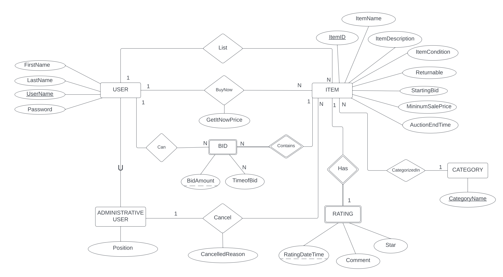

# Auction Database Application

## Description
Auction Database Application named BuzzBid is a database application that integrates MySQL and Flask for its functionality. It serves as an auction site, facilitating auction activities for users and administrative functions for administrators. Key user activities include listing items, bidding on specific items, searching, and viewing auction results. Administrative operations involve managing user activities and auctions within the administrative scope. The application aims to offer a user-friendly interface that is easy to navigate while adhering to business constraints regarding auctions.

## Project Components:
1. Information Flow Diagram (IFD):
    Graphically represents how data flows within the database system between different components.
2. Enhanced Entity-Relationship (EER) Diagram:
    Used for conceptualizing and designing the database schema at a high level.
3. Relational Mapping Diagram:
    Defines mappings between classes and database tables, aiding in SQL generation.
4. Task Decomposition Report:
    Includes data types, business constraints, and SQL queries for specific tasks.


### Information Flow Diagram (IFD):

### Enhanced Entity-Relationship (EER):

## Relational Mapping Diagram (RM):

### Task Decomposition with Queries:
https://github.com/vynguyen452810/BuzzBid/blob/main/document/task_decomposition_abstract_code.pdf


## To run the BuzzBid application, follow these steps:

1. **Install Dependencies:**
   Make sure you have all the necessary dependencies installed.
    - Python
    - MySQL
    - Python-Flask
    - HTML
    - CSS
    - JavaScript

2. **Navigate to the BuzzBid Directory:**
   - Open a terminal or command prompt.
   - Navigate to the directory where the BuzzBid application is located.

3. **Changing password for app configuration coressponding to yor MySQL host:**
    ```bash
        app.config["MYSQL_DB"] = "your_password_here"
    ```

4. **Run the Application:**
   - Execute the following command in the terminal or command prompt:
     ```bash
     python app.py
     ```
   This command starts the BuzzBid application.

5. **Access the Application:**
   - After running the application, you will be provided with a URL, typically `http://127.0.0.1:5000`.
   - Open a web browser.
   - Enter the provided URL in the address bar and press Enter.
   - This will navigate you to the BuzzBid application running locally on your machine.

These steps should get the BuzzBid application up and running on your local environment.


